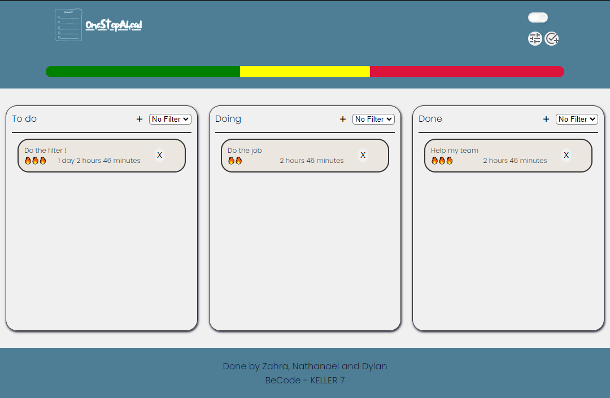
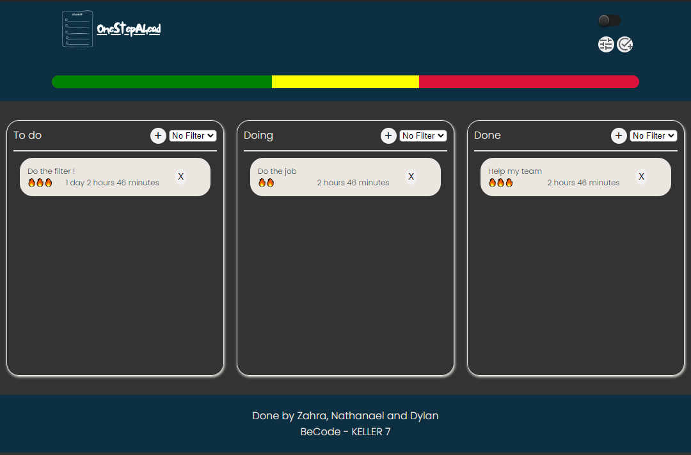

# projectPlanner

Projet réalisé dans le cadre de ma formation chez Becode.
Ce projet visait à mettre en oeuvre nos compétences acquises en JavaScript.

## Table of contents

- [Overview](#overview)
  - [The challenge](#the-challenge)
  - [Screenshot](#screenshot)
  - [Links](#links)
- [My process](#my-process)
  - [Built with](#built-with)
- [Author](#author)

## Overview

### Le challenge

- Une création de tâche dans lequel on peut donner un nom, une description, une deadline et un nombre de points.
- 3 panneaux dans lequel on affiche les tâches (à faire, en réalisation et fini). L'idée est de réaliser un affichage du nom et de la deadline (petit tricks, au hover, on a la description de la tâche)
- Une fonction de tri (par date, par nom et par type (à faire etc))
- LocalStorage
- Darkmode
- Mobile first
- système de point pour marquer la progression
- petit bonus -> drag and drop pour changer de tableau la tâche

### Screenshot

### Links

- Live Site URL: [https://happyfeys.github.io/projectPlanner/](https://happyfeys.github.io/projectPlanner/)

## My process

### Build with

- Semantic HTML5 markup
- SCSS
- JavaScript Vanilla
- Flexbox
- Mobile-first workflow

## Auteur

- [Zahra](https://github.com/zaraana)
- [Nathanael](https://github.com/NathAmd)
- [Dylan](https://github.com/HappyFeys)